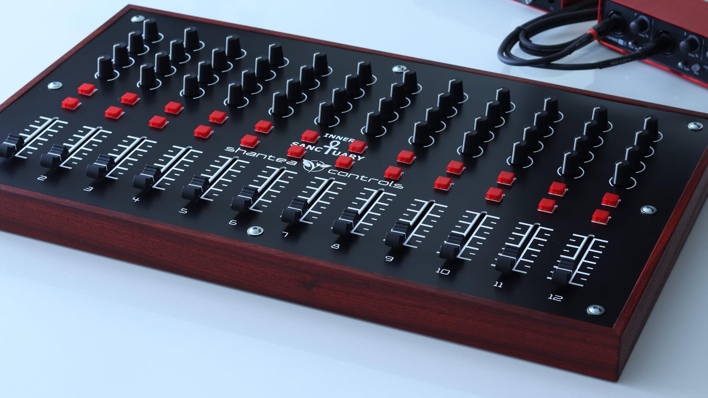

# Building an Open-Source MIDI Controller with Raspberry Pi Pico

*A complete guide to designing a professional-grade MIDI controller with buttons, knobs, and faders*

**Author:** proper-noble  
**Date:** December 20, 2025

---

## Introduction

Commercial MIDI controllers can be expensive and often don't match the exact layout musicians need. In this article, I'll walk through the design of an open-source, customizable MIDI controller built around the Raspberry Pi Pico.  This project draws inspiration from professional controllers like those made by Shantea Controls (OpenDeck) and leverages the flexibility of CircuitPython for rapid development.

Whether you're a producer wanting a custom DAW controller, a live performer needing specific button layouts, or a hobbyist interested in DIY electronics, this guide provides a foundation you can adapt to your needs.


### Final Design Inspiration



---

## Design Goals

Before diving into the technical details, let's establish what we're building:

| Goal | Description |
|------|-------------|
| **Flexible Control Surface** | Support for buttons, rotary knobs, and linear faders |
| **Low Latency** | Sub-10ms response time for real-time performance |
| **USB Class-Compliant** | Works with any DAW without drivers |
| **Configurable** | Change mappings without reflashing firmware |
| **Expandable** | Architecture supports future additions (displays, wireless, etc.) |
| **No Arduino** | Pure CircuitPython or C SDK for cleaner, more portable code |

---

## Hardware Architecture

### Core Components

The heart of the controller is a **Raspberry Pi Pico**, chosen for its: 
- Dual-core ARM Cortex-M0+ at 133 MHz
- Native USB with device support (perfect for USB MIDI)
- 26 GPIO pins
- 3 ADC channels (expandable via multiplexer)
- Low cost (~$4 USD)
- Excellent CircuitPython and C SDK support

### System Block Diagram

```
┌─────────────────────────────────────────────────────────────────┐
│                      Raspberry Pi Pico                          │
│                                                                 │
│   GPIO (Digital)           ADC (Analog)          I2C/SPI       │
│        │                        │                    │         │
│        ▼                        ▼                    ▼         │
│   ┌──────────┐          ┌─────────────┐      ┌─────────────┐   │
│   │ Buttons  │          │ CD74HC4067  │      │ LED Driver  │   │
│   │ (8-16x)  │          │ 16-ch MUX   │      │ (TLC5947)   │   │
│   │ w/ LEDs  │          │             │      │             │   │
│   └──────────┘          │ ┌─────────┐ │      └─────────────┘   │
│                         │ │ Knobs   │ │                        │
│                         │ │ (8-16x) │ │                        │
│                         │ └─────────┘ │                        │
│                         │ ┌─────────┐ │                        │
│                         │ │ Faders  │ │                        │
│                         │ │ (4-8x)  │ │                        │
│                         │ └─────────┘ │                        │
│                         └─────────────┘                        │
│                                                                 │
│   USB ──────► TinyUSB / adafruit_midi ──────► Computer/DAW     │
└─────────────────────────────────────────────────────────────────┘
```

### Control Specifications

| Control Type | Quantity | Hardware | MIDI Output |
|--------------|----------|----------|-------------|
| **Buttons** | 8–16 | Illuminated arcade or tactile switches | Note On/Off or CC |
| **Knobs** | 8–16 | 10kΩ linear potentiometers | CC (0-127) |
| **Faders** | 4–8 | 10kΩ linear slide potentiometers (45-60mm) | CC (0-127) |
| **LEDs** | 16–32 | Per-button + status indicators | Feedback from DAW |

### Solving the ADC Limitation

The Pico has only 3 ADC pins, but we need 12-24 analog inputs for knobs and faders. The solution is an **analog multiplexer**:

**CD74HC4067** - 16-channel analog multiplexer
- 4 digital select lines (S0-S3) choose which input to read
- Single analog output connects to one Pico ADC pin
- Chain two for 32 analog inputs
- Fast switching (~100ns) allows scanning all channels at audio rates

```
         ┌──────────────────┐
Knob 0 ──┤ C0           SIG ├──── Pico GP26 (ADC0)
Knob 1 ──┤ C1               │
Knob 2 ──┤ C2            S0 ├──── Pico GP10
  ...    │ ...           S1 ├──── Pico GP11
Knob 15──┤ C15           S2 ├──── Pico GP12
         │               S3 ├──── Pico GP13
         │              GND ├──── GND
         │              VCC ├──── 3.3V
         └──────────────────┘
```

### LED Management

For 16+ LEDs with PWM brightness control, we offload to a dedicated driver:

**TLC5947** - 24-channel, 12-bit PWM LED driver
- SPI interface (3 wires:  CLK, DATA, LATCH)
- Constant-current outputs (no resistors needed)
- Daisy-chainable for more channels

Alternative: **74HC595** shift register for simple on/off control with fewer components. 

---

## Firmware Architecture

### Why Not Arduino?

While Arduino has a massive ecosystem, we're avoiding it for several reasons:

1. **Cleaner abstraction** - CircuitPython's hardware APIs are more Pythonic and readable
2. **No compilation** - Edit code directly on the device's USB drive
3. **Better MIDI libraries** - `adafruit_midi` is well-maintained and comprehensive
4. **Easier configuration** - JSON config files on the filesystem
5. **Portable patterns** - Concepts transfer directly to C SDK if we need lower latency later

### Software Layers

```
┌─────────────────────────────────────────┐
│           Application Layer             │
│  (Banks, Presets, LED Animations)       │
├─────────────────────────────────────────┤
│            MIDI Layer                   │
│  (Note, CC, Program Change, SysEx)      │
├─────────────────────────────────────────┤
│          Transport Layer                │
│  (USB MIDI, future:  TRS, WiFi/OSC)      │
├─────────────────────────────────────────┤
│        Input Processing Layer           │
│  (Debounce, Filtering, Edge Detection)  │
├─────────────────────────────────────────┤
│      Hardware Abstraction Layer         │
│  (Pin maps, MUX driver, LED driver)     │
├─────────────────────────────────────────┤
│           CircuitPython                 │
└─────────────────────────────────────────┘
```

### Input Processing

#### Button Debouncing

Mechanical switches "bounce" when pressed, causing multiple false triggers. We implement a simple time-based debounce:

```python
DEBOUNCE_MS = 5  # Ignore changes within 5ms of last change

def process_button(button, current_time):
    pressed = not button["pin"].value  # Active low
    
    if pressed != button["state"]:
        if (current_time - button["last_change"]) > DEBOUNCE_MS:
            button["last_change"] = current_time
            button["state"] = pressed
            return ("pressed" if pressed else "released")
    
    return None  # No change
```

#### Analog Filtering

Potentiometers can be noisy.  We apply two techniques:

1. **Deadband** - Only send MIDI if value changes by more than threshold (typically 2)
2. **Exponential Moving Average (EMA)** - Smooth rapid fluctuations

```python
DEADBAND = 2
EMA_ALPHA = 0.3

def process_analog(analog, raw_value):
    # Apply EMA filter
    if analog["filtered_value"] is None:
        analog["filtered_value"] = raw_value
    else:
        analog["filtered_value"] = (EMA_ALPHA * raw_value + 
                                    (1 - EMA_ALPHA) * analog["filtered_value"])
    
    value = int(analog["filtered_value"])
    
    # Apply deadband
    if abs(value - analog["last_sent"]) > DEADBAND:
        analog["last_sent"] = value
        return value
    
    return None  # No change worth sending
```

---

## Configuration System

A key design goal is changing MIDI mappings without reflashing.  We use a JSON configuration file stored on the Pico's filesystem:

### Configuration Schema

```json
{
  "device": {
    "name": "PicoMIDI Controller",
    "version": "1.0.0"
  },
  
  "buttons": [
    {
      "id": 0,
      "pin": "GP2",
      "led_index": 0,
      "type": "momentary",
      "midi":  {
        "type": "note",
        "note": 36,
        "channel": 0,
        "velocity": 100
      }
    },
    {
      "id": 1,
      "pin": "GP3",
      "led_index": 1,
      "type": "toggle",
      "midi": {
        "type": "cc",
        "cc": 64,
        "channel": 0
      }
    }
  ],
  
  "knobs": [
    {
      "id":  0,
      "mux_channel": 0,
      "midi": {
        "type": "cc",
        "cc": 1,
        "channel": 0
      },
      "filter": "ema",
      "deadband": 2
    }
  ],
  
  "faders": [
    {
      "id": 0,
      "mux_channel": 8,
      "midi": {
        "type": "cc",
        "cc": 7,
        "channel": 0
      },
      "filter":  "ema",
      "deadband": 2
    }
  ],
  
  "leds":  {
    "driver": "tlc5947",
    "spi_pins": {
      "clk": "GP18",
      "mosi":  "GP19",
      "latch": "GP20"
    },
    "default_brightness": 128
  },
  
  "banks": [
    {"name": "Main", "note_offset": 0, "cc_offset": 0},
    {"name": "FX", "note_offset": 12, "cc_offset": 16},
    {"name": "Mixer", "note_offset": 24, "cc_offset": 32}
  ],
  
  "settings": {
    "debounce_ms": 5,
    "analog_sample_rate_hz": 200,
    "led_feedback": true
  }
}
```

### Button Types

| Type | Behavior | Use Case |
|------|----------|----------|
| `momentary` | Note On when pressed, Note Off when released | Drum pads, triggers |
| `toggle` | Alternates between on/off states | Mute, solo, arm |
| `radio` | Only one in group active at a time | Track selection |

---

## Complete Firmware Implementation

Here's the full CircuitPython implementation:

```python
"""
PicoMIDI Controller Firmware
A configurable MIDI controller with buttons, knobs, and faders
"""

import board
import digitalio
import analogio
import time
import json
from adafruit_midi import MIDI
from adafruit_midi.note_on import NoteOn
from adafruit_midi.note_off import NoteOff
from adafruit_midi.control_change import ControlChange
import usb_midi


class MuxReader:
    """CD74HC4067 16-channel analog multiplexer driver"""
    
    def __init__(self, sig_pin, select_pins):
        self.sig = analogio.AnalogIn(sig_pin)
        self.select = []
        for pin in select_pins:
            dio = digitalio.DigitalInOut(pin)
            dio.switch_to_output()
            self.select.append(dio)
    
    def read(self, channel):
        """Read analog value from specified MUX channel (0-15)"""
        for i in range(4):
            self.select[i].value = (channel >> i) & 1
        time.sleep(0.0001)  # Allow signal to settle
        return self.sig.value >> 9  # Convert 16-bit to 7-bit (0-127)


class Button:
    """Debounced button with LED feedback"""
    
    def __init__(self, config, debounce_ms=5):
        self.config = config
        self.debounce_ms = debounce_ms
        
        self.pin = digitalio.DigitalInOut(getattr(board, config["pin"]))
        self.pin.switch_to_input(pull=digitalio.Pull.UP)
        
        self.state = False
        self.toggle_state = False
        self. last_change = 0
    
    def update(self, current_time):
        """Check for state changes, returns event or None"""
        pressed = not self.pin.value
        
        if pressed != self.state:
            if (current_time - self.last_change) > self.debounce_ms:
                self.last_change = current_time
                self.state = pressed
                
                if self.config. get("type") == "toggle":
                    if pressed:
                        self.toggle_state = not self.toggle_state
                        return "toggle_on" if self.toggle_state else "toggle_off"
                else:
                    return "pressed" if pressed else "released"
        
        return None


class AnalogControl:
    """Filtered analog input (knob or fader)"""
    
    def __init__(self, config, mux, deadband=2, ema_alpha=0.3):
        self.config = config
        self.mux = mux
        self.mux_channel = config["mux_channel"]
        self.deadband = config. get("deadband", deadband)
        self.ema_alpha = ema_alpha
        
        self.filtered_value = None
        self.last_sent = -1
    
    def update(self):
        """Read and filter value, returns new value or None if unchanged"""
        raw = self.mux.read(self.mux_channel)
        
        # Apply EMA filter
        if self.filtered_value is None:
            self.filtered_value = raw
        else:
            self. filtered_value = (self. ema_alpha * raw + 
                                   (1 - self.ema_alpha) * self.filtered_value)
        
        value = int(self.filtered_value)
        
        # Apply deadband
        if self.last_sent < 0 or abs(value - self.last_sent) > self.deadband:
            self. last_sent = value
            return value
        
        return None


class LEDController:
    """Simple GPIO LED controller (can be extended for TLC5947)"""
    
    def __init__(self, led_configs):
        self.leds = []
        for cfg in led_configs:
            pin = digitalio.DigitalInOut(getattr(board, cfg["pin"]))
            pin.switch_to_output(value=False)
            self.leds. append(pin)
    
    def set(self, index, state):
        """Set LED on/off"""
        if 0 <= index < len(self.leds):
            self.leds[index].value = state
    
    def set_all(self, state):
        """Set all LEDs to same state"""
        for led in self.leds:
            led. value = state


class MIDIController:
    """Main controller class"""
    
    def __init__(self, config_path="config.json"):
        # Load configuration
        with open(config_path, "r") as f:
            self.config = json.load(f)
        
        # Initialize MIDI
        self.midi = MIDI(midi_out=usb_midi.ports[1], out_channel=0)
        
        # Initialize MUX for analog inputs
        self.mux = MuxReader(
            board.GP26,
            [board.GP10, board.GP11, board.GP12, board. GP13]
        )
        
        # Initialize buttons
        self.buttons = []
        debounce = self.config.get("settings", {}).get("debounce_ms", 5)
        for btn_cfg in self.config. get("buttons", []):
            self.buttons.append(Button(btn_cfg, debounce))
        
        # Initialize knobs and faders
        self.analogs = []
        for knob_cfg in self.config.get("knobs", []):
            self.analogs.append(AnalogControl(knob_cfg, self.mux))
        for fader_cfg in self.config.get("faders", []):
            self.analogs.append(AnalogControl(fader_cfg, self.mux))
        
        # Initialize LEDs (simple GPIO version)
        led_pins = self.config.get("led_pins", [])
        if led_pins:
            self. leds = LEDController([{"pin": p} for p in led_pins])
        else:
            self. leds = None
        
        # Bank management
        self.banks = self.config.get("banks", [{"name": "Default", "note_offset": 0, "cc_offset": 0}])
        self.current_bank = 0
    
    def get_bank_offset(self, offset_type):
        """Get current bank's offset for notes or CCs"""
        return self.banks[self.current_bank]. get(offset_type, 0)
    
    def handle_button_event(self, button, event):
        """Process button event and send MIDI"""
        cfg = button.config
        midi_cfg = cfg.get("midi", {})
        channel = midi_cfg.get("channel", 0)
        
        if midi_cfg.get("type") == "note":
            note = midi_cfg["note"] + self.get_bank_offset("note_offset")
            velocity = midi_cfg.get("velocity", 100)
            
            if event == "pressed":
                self.midi.send(NoteOn(note, velocity), channel=channel)
                if self.leds and "led_index" in cfg: 
                    self.leds.set(cfg["led_index"], True)
            elif event == "released":
                self.midi.send(NoteOff(note, 0), channel=channel)
                if self.leds and "led_index" in cfg:
                    self.leds.set(cfg["led_index"], False)
        
        elif midi_cfg.get("type") == "cc":
            cc = midi_cfg["cc"] + self.get_bank_offset("cc_offset")
            
            if event in ("pressed", "toggle_on"):
                self.midi.send(ControlChange(cc, 127), channel=channel)
                if self.leds and "led_index" in cfg:
                    self.leds.set(cfg["led_index"], True)
            elif event in ("released", "toggle_off"):
                self.midi.send(ControlChange(cc, 0), channel=channel)
                if self.leds and "led_index" in cfg:
                    self.leds.set(cfg["led_index"], False)
    
    def handle_analog_change(self, analog, value):
        """Process analog change and send MIDI CC"""
        midi_cfg = analog.config.get("midi", {})
        cc = midi_cfg.get("cc", 1) + self.get_bank_offset("cc_offset")
        channel = midi_cfg.get("channel", 0)
        
        self.midi.send(ControlChange(cc, value), channel=channel)
    
    def run(self):
        """Main loop"""
        print(f"PicoMIDI Controller started")
        print(f"  Buttons: {len(self.buttons)}")
        print(f"  Analog controls: {len(self.analogs)}")
        print(f"  Banks: {len(self.banks)}")
        
        while True:
            now = time.monotonic_ns() // 1_000_000
            
            # Process buttons
            for button in self. buttons:
                event = button.update(now)
                if event:
                    self.handle_button_event(button, event)
            
            # Process analog controls
            for analog in self. analogs:
                value = analog.update()
                if value is not None:
                    self.handle_analog_change(analog, value)
            
            # Small delay to prevent tight spinning
            time.sleep(0.001)


# Entry point
if __name__ == "__main__":
    controller = MIDIController()
    controller.run()
```

---

## Bill of Materials

### Core Electronics

| Component | Quantity | Notes | Approx. Cost |
|-----------|----------|-------|--------------|
| Raspberry Pi Pico | 1 | Or Pico W for future wireless | $4-6 |
| CD74HC4067 breakout | 1-2 | 16-ch analog MUX | $2-5 each |
| TLC5947 breakout | 1 | 24-ch LED driver (optional) | $8-10 |
| USB-C breakout | 1 | Panel mount (optional) | $2-3 |

### Controls

| Component | Quantity | Notes | Approx. Cost |
|-----------|----------|-------|--------------|
| 10kΩ linear potentiometers | 8-16 | For knobs, various shaft types | $1-2 each |
| 10kΩ linear slide pots | 4-8 | 45-60mm travel | $2-4 each |
| Illuminated arcade buttons | 8-16 | 24mm or 30mm, various colors | $2-4 each |
| Knob caps | 8-16 | Match pot shaft diameter | $0.50-2 each |
| Fader caps/knobs | 4-8 | Match slide pot | $1-2 each |

### Passive Components

| Component | Quantity | Notes |
|-----------|----------|-------|
| Resistors (150-330Ω) | 20-30 | For LEDs if not using driver |
| Capacitors (100nF) | 5-10 | Decoupling |
| Capacitors (10µF) | 2-3 | Power filtering |

### Enclosure & Wiring

| Component | Quantity | Notes |
|-----------|----------|-------|
| Enclosure | 1 | Laser-cut, 3D printed, or wood |
| Hookup wire | 1 roll | 22-24 AWG stranded |
| PCB or perfboard | 1-2 | For mounting components |
| Standoffs, screws | Assorted | M3 typical |

**Estimated Total: $80-200** depending on control count and enclosure choices

---

## Enclosure Design Considerations

Based on the inspiration images, here are common enclosure approaches:

### Materials

1. **Laser-cut acrylic** - Clean, modern look; easy to prototype
2. **3D printed** - Maximum flexibility; good for complex shapes
3. **Wood sides + metal/acrylic top** - Professional feel; good for desktop use
4. **Aluminum** - Most durable; requires more tooling

### Layout Tips

- **Group related controls** - Keep faders in a row, knobs in a grid
- **Angle the surface** - 10-15° tilt improves ergonomics
- **Leave space for labels** - Below or beside each control
- **Plan for the PCB** - Consider mounting depth for pots and buttons
- **USB access** - Panel-mount connector or routed slot

---

## Future Enhancements

This design provides a foundation that can grow: 

### Near-term

- **OLED display** - Show current bank, CC values, parameter names
- **Rotary encoders** - Endless rotation for relative control
- **RGB LEDs** - Per-button color coding by function
- **Motorized faders** - Bidirectional DAW integration

### Long-term

- **Pico W wireless** - WiFi for OSC, wireless MIDI
- **TRS MIDI output** - Connect to hardware synths
- **Expansion ports** - Modular additional control surfaces
- **Custom PCB** - Cleaner build, easier assembly

---

## Reference Projects

This design draws inspiration from several excellent open-source projects:

- **[OpenDeck](https://github.com/shanteacontrols/OpenDeck)** - Comprehensive MIDI controller platform with web configurator
- **[Control Surface](https://github.com/tttapa/Control-Surface)** - Arduino library with excellent abstractions (studied for patterns, not used directly)
- **[Adafruit Pico MIDI Controller](https://learn.adafruit.com/raspberry-pi-pico-led-arcade-button-midi-controller-fighter)** - Starting point for Pico + CircuitPython MIDI

---

## Conclusion

Building a custom MIDI controller is a rewarding project that combines hardware design, firmware development, and creative expression. The Raspberry Pi Pico provides an excellent foundation with its low cost, USB MIDI support, and flexible I/O. 

By using CircuitPython and a JSON configuration system, we've created a platform that's: 
- **Accessible** - No complex toolchains or compilation
- **Flexible** - Easily remapped for different uses
- **Extensible** - Clean architecture for adding features
- **Affordable** - Professional results at a fraction of commercial cost

The complete source code and configuration examples are available to help you get started. Whether you build the reference design exactly or use it as a starting point for something completely custom, I hope this guide helps you create the perfect controller for your music-making workflow.

---

*Have questions or want to share your build? Feel free to reach out or open an issue on the project repository.*